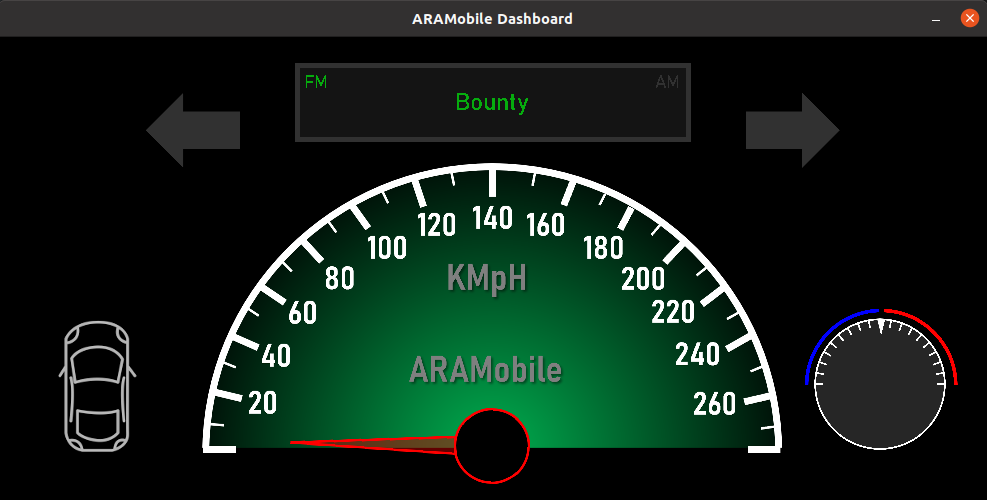
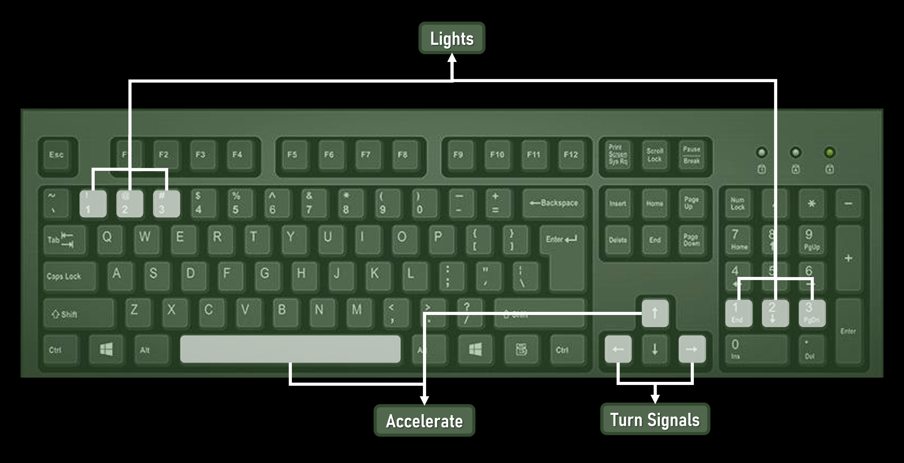

ARAMobile Simulator for SocketCAN
------------------------------------------

Compiling
---------
You will need:
* SDL2
* SDL2_image
* SDL2_ttf
* can-utils

```
  sudo apt-get install libsdl2-dev libsdl2-image-dev libsdl2-ttf-dev can-utils  
```

With dependencies installed, you may build the project:

```bash
  gcc keyboard/*.c -o build/keyboard.out -I/usr/include/SDL2 -Wall -Wextra -lSDL2 -lSDL2_image -lSDL2_ttf
  gcc dashboard/*.c -o build/dashboard.out -I/usr/include/SDL2 -Wall -Wextra -lSDL2 -lSDL2_image -lSDL2_ttf
```

A build.sh file has also been provided with this repo.

Testing on a virtual CAN interface
----------------------------------
You can run the following commands to setup a virtual can interface

```bash
  sudo modprobe can
  sudo modprobe vcan
  sudo ip link add dev vcan0 type vcan
  sudo ip link set up vcan0
```

If you type ifconfig vcan0 you should see a vcan0 interface.  
A setup_vcan.sh file has also been provided with this repo.

Usage
-----
Default operations:

Start the keyboard:

```
  ./keyboard.out vcan0
```

Then startup the dashboard

```
  ./dashboard.out vcan0
```

The keyboard app will generate corrosponding CAN packets based on the buttons you press.  
The dashboard sniffs the CAN and looks for relevant CAN packets that would change the display.  
A run.sh file has also been provided with this repo.

Scripts
-------
The simulator designed for research use  
I order to write python scripts that communicate with the can interface you will need the python-can library:

```bash
  pip install python-can
```

Exercises
---------
List of analyze & development exercises:

### Horn
- Find the relevant ID and understand the value protocol
- Write a script that disables the horn system
- Write a script that forces the horn to beep constantly
- Write a script that fully controls the horn system - let the user choose to:
  1. start beep
  2. stop beep

### Signals
- Find the relevant ID and understand the value protocol
- Write a script that disables the signals system
- Write a script that switches the signals direction
  - right signal if the driver turns left
  - left signal if the driver turns right
- Write a script that fully controls the signals system - let the user choose to:
  1. turn off signals
  2. turn on left signal
  3. turn on right signal
  4. turn on both signals

### Lights
- Find the relevant IDs and understand the value protocol
- Write a script that disables the lights system
- Write a script that switches the lights volume
  - low lights if the driver turns on the high lights
  - high lights if the driver turns on the low lights 
- Write a script that fully controls the lights system - let the user choose to:
  1. turn off lights
  2. turn on low lights
  3. turn on medium lights
  4. turn on high lights

### Speed
- Find the relevant ID and understand the value protocol
- Write a script that locks the speed as the current speed
- Write a script that accelerates the speed
- Write a script that controls the speed and returns the control to the driver at the end - let the user choose to: 
  1. lock the speed
  2. accelerate
  3. decelerate

### Doors
- Find the relevant ID and understand the value protocol
- Write a script that locks the doors forever
- Write a script that unlocks the doors forever
- Write a script that controls the doors system - let the user choose to: 
  1. open/close front left door
  2. open/close front right door
  3. open/close back left door
  4. open/close back right door

### Radio
- Find the relevant IDs and understand the value protocol
- Write a script that controls the radio volume system - let the user choose the volume
- Write a script that writes "ARAM" on the screen

### Air Conditioner
- Find the relevant ID and understand the value protocol
- Write a script that controls the air conditioner system - let the user choose any degree for the air conditioner

Solutions
---------

A solutions directory with solutions has also been provided with this repo.  
The binary_search.sh script is used to find a specific command using the binary search algorithm

Images
------

### Dashboard



### Keyboard



