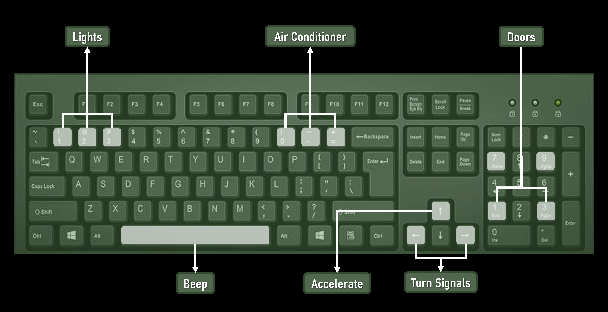

ARAMobile Simulator for SocketCAN
------------------------------------------

Compiling
---------
You will need:
* SDL2
* SDL2_image
* SDL2_ttf
* can-utils

You can get can-utils from github or on Ubuntu you may run the following

```
  sudo apt-get install libsdl2-dev libsdl2-image-dev libsdl-ttf-dev can-utils  
```

With dependencies installed, you may build the project:

```bash
  gcc keyboard/*.c -o build/keyboard.out -I/usr/include/SDL2 -Wall -Wextra -lSDL2 -lSDL2_image -lSDL2_ttf
  gcc dashboard/*.c -o build/dashboard.out -I/usr/include/SDL2 -Wall -Wextra -lSDL2 -lSDL2_image -lSDL2_ttf
```

A build.sh file has also been provided with this repo.

Testing on a virtual CAN interface
----------------------------------
You can run the following commands to setup a virtual can interface

```
  sudo modprobe can
  sudo modprobe vcan
  sudo ip link add dev vcan0 type vcan
  sudo ip link set up vcan0
```

If you type ifconfig vcan0 you should see a vcan0 interface. A setup_vcan.sh file has also been provided with this repo.

Usage
-----
Default operations:

Start the keyboard:

```
  ./keyboard.out vcan0
```

Then startup the dashboard

```
  ./dashboard.out vcan0
```

The keyboard app will generate corrosponding CAN packets based on the buttons you press.  
The dashboard sniffs the CAN and looks for relevant CAN packets that would change the display.

Images
------

### Dashboard


### Keyboard

